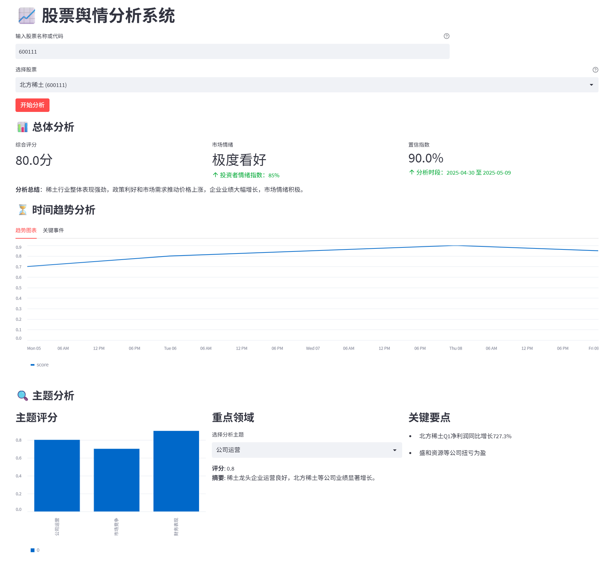
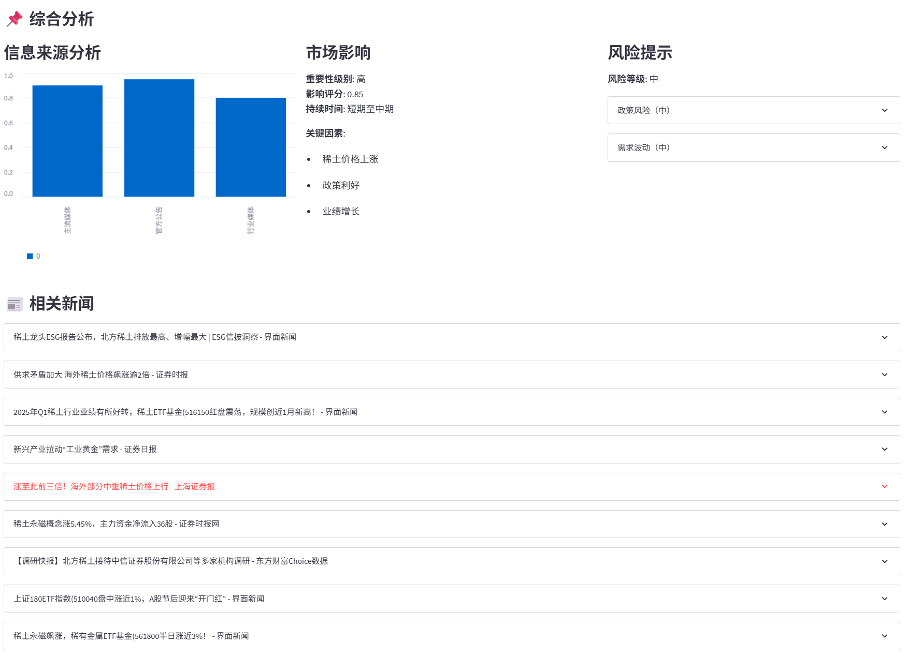

# 股票舆情分析系统 - 前端应用

## 项目概述
这是一个基于Streamlit构建的股票舆情分析系统前端应用，用于展示和分析股票相关的舆情数据。系统通过调用后端API获取数据，并以可视化方式展示股票的综合评分、市场情绪、主题分析、风险提示等信息。

### 数据可视化
- 使用图表(柱状图、折线图)直观展示数据
- 卡片式布局清晰呈现关键指标
- 交互式展开面板查看更多详情

## 安装与运行

### 前置条件
- Python 3.7+
- 后端API服务已启动并运行

### 安装步骤
1. 克隆项目仓库
2. 安装依赖：
```bash
pip install -r requirements.txt
streamlit run frontend-streamlit/main.py
```

### 页面展示

